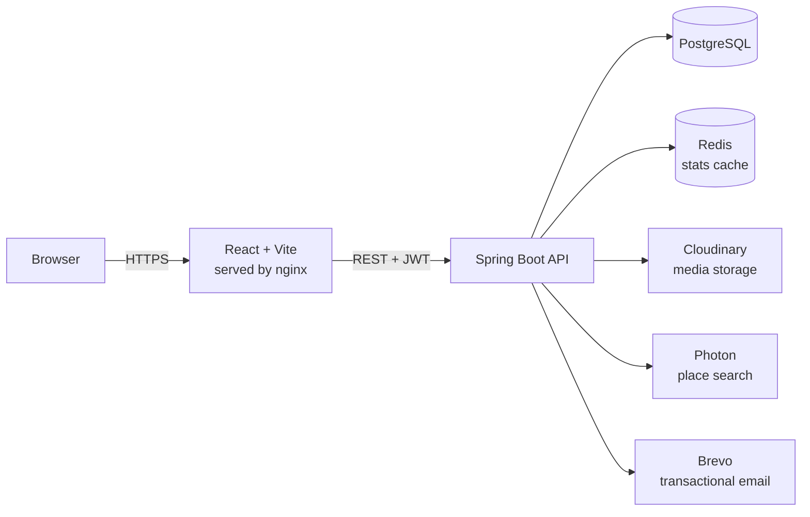

# MemoryMap

[](https://github.com/Caicai-Jin/memorymap/actions/workflows/ci.yml)

A personal moment/mood journal. Every entry can carry text, photos, videos, a mood, and a location — all optional, in any combination — and every location you've recorded renders on a private map of everywhere you've been.

## Why MemoryMap

MemoryMap is not a food-review app.

It's built on a simple belief: life is made up of moments, and every one of them is worth keeping — not just the polished, exciting ones. A great meal you finally found time to enjoy. An afternoon of cherry picking, or a gym session that left you genuinely happy. A job interview that ended in rejection. An argument that turned into a breakup, right there at your usual bubble tea spot. A walk through a mall with no particular purpose. An anxious, embarrassing moment that turned warm because a stranger, without being asked, quietly helped you out. Rain outside your window at night, and a calm before sleep that you can't quite explain.

None of these are "content." They're just life. MemoryMap exists so you can record them as they are — happy, sad, or the kind of open, hard-to-name feeling that doesn't fit either label — with text, a photo or video, a mood, and optionally, a place.

Location is a supporting feature, not the point. If you attach a place to a moment, it appears on your own private map over time, so you can look back and see where your life has happened. But MemoryMap is deliberately not a travel app, and it never assumes you have the money or ability to go anywhere. A moment recorded at your kitchen table counts exactly as much as one recorded at the top of a mountain — the stressful evenings spent sending out job applications from home, the small joy of pulling a cake you made yourself out of the oven, both belong here just as much as anywhere else.

## Key Features

- **Moments** — create, edit, and delete journal entries with optional text, mood tags, media, and location, each secured to its owner
- **Media** — photo/video uploads via Cloudinary, with enforced limits (9 items per moment, 3 videos max, 60s per video, 50MB per file)
- **Locations** — real-world place search (with a manual pin-drop fallback for addresses OpenStreetMap doesn't have precisely indexed), and a dedicated Home address that is masked server-side on every response — other consumers of the API only ever see `"Home"`, never the real address or coordinates
- **Map view** — every public location plotted on an interactive map; Home locations never appear
- **Stats** — yearly mood breakdown and dominant-mood/location summaries, cached in Redis
- **Auth** — JWT-based registration and login, with every endpoint enforcing per-user ownership; registration requires clicking a real emailed verification link before login is allowed, and password reset works the same way (emailed link, not a code)

## Architecture



The frontend never talks to Postgres, Redis, Cloudinary, or Photon directly — every request goes through the backend, which is the single point enforcing authentication, ownership, and the Home-location masking rule.

## Tech Stack

**Backend** — Java 21, Spring Boot 4, Spring Security (JWT), Spring Data JPA, Spring Data Redis, Bean Validation, springdoc-openapi

**Frontend** — React 19, Vite, React Router, Tailwind CSS, React Leaflet

**Data & external services** — PostgreSQL, Redis, Cloudinary (media storage), Photon (place search, OpenStreetMap-based), Brevo (transactional email for verification/password reset)

**Infrastructure** — Docker Compose, GitHub Actions CI

## Notable Design Decisions

- **Server-side privacy masking.** A user's Home location is desensitized in the API layer itself, not hidden client-side — `LocationService.maskIfHome` returns a location with only the literal name `"Home"` and no address or coordinates whenever it's attached to a moment, so no API consumer can ever recover it, regardless of how the response is used.
- **Ownership enforced at the service layer.** Every read/update/delete on a moment or location re-fetches the record and checks it against the authenticated user before proceeding, closing a class of IDOR vulnerabilities where a valid token for one account could be used to access another account's data by guessing an id.
- **Upload limits validated before the network call, not after.** File-size and Cloudinary-upload-count checks run before any file is sent to Cloudinary, so a rejected upload never wastes bandwidth or storage on a file that was going to be deleted anyway.
- **Both automated-test styles, deliberately.** The core ownership rule is covered by both a unit test (mocked dependencies, isolated logic) and an end-to-end test (real HTTP layer, real database) — see `MomentServiceTest` and `MomentOwnershipTest`.

## Challenges I Ran Into

**Users could access each other's moments by just changing the URL.** Early in Phase 2, `/moments/{id}` fetched a moment by id with no ownership check — log in as anyone, swap the id in the URL, and you could read, edit, or delete someone else's entries. It's a textbook IDOR (insecure direct object reference), and it's easy to miss because the happy path — you fetching your own moment — works perfectly fine while it's broken. I fixed it by comparing the moment's owner against the authenticated user on every read/update/delete in `MomentService`, then wrote `MomentOwnershipTest` specifically to register two separate users and prove one gets a 403 touching the other's data — not just that a single user's own CRUD works.

**Showing "near home" without showing home.** The home-location feature — mark a spot as your address, see mood patterns near it in stats — meant the exact coordinates had to flow through the same code paths as every other location, but never actually reach the client. Trimming it in the frontend wasn't good enough, since anyone could hit the API directly. I centralized the fix in one place, `LocationService.maskIfHome`, which swaps in a stripped-down location (name `"Home"`, no address, no coordinates) whenever the type is `HOME`, and made sure both the moment response and the stats response route through it before anything leaves the server.

**Stats went stale after editing a moment.** Once yearly stats were cached in Redis, keyed by user and year, creating or editing a moment didn't touch that cache — so you could add a new entry and still see last week's mood breakdown. I added a cache-eviction step after every write in `MomentService` that clears just that user's cached years instead of flushing the whole cache, so it doesn't affect other users.

**Trusting the client on video length.** Upload limits (9 items, 3 videos, 60s, 50MB) sounded simple until I realized duration isn't something you can check from file size or a MIME type — a client could just lie about it. File size gets checked before the file is ever sent to Cloudinary, so an oversized upload is rejected instantly. Duration only exists once Cloudinary has actually processed the file, so that check happens after upload, and if it fails, the now-useless clip is deleted from Cloudinary right away instead of sitting in storage forever.

**Deciding how to test ownership logic.** I didn't want to mock my way through the ownership rule and call it tested — a mock can't tell me the real HTTP layer, the JWT filter, and the database are actually wired together correctly. So one test covers the logic in isolation with mocked dependencies, and a separate one spins up the full app, registers two real users, and asserts a 403 over actual HTTP. Slower, but it's the one that would have caught the original IDOR bug.

**Config that only worked on localhost.** Early on, the frontend's API URL and the backend's allowed CORS origin were both hardcoded to localhost ports, which broke the moment I deployed to Render, since the frontend and backend now live on different domains. I moved both to environment variables instead, so the same build works locally and in production without touching code.

**A login/register request that failed with zero feedback.** The free-tier backend spins down after 15 minutes idle and takes 30-60 seconds to wake back up, but the `fetch` calls in `Login.jsx`/`Register.jsx` had no loading state and no error handling — so on a cold start, clicking "Sign up" just looked like the button did nothing. I added a `loading` state that disables the button and swaps its label while the request is in flight, plus a `catch` block that surfaces a clear message if the request fails outright instead of failing silently.

**A silent form submission that quietly dropped the location.** The location-search box lived inside the same `<form>` as the rest of the "new moment" fields, so pressing Enter to trigger a search did something unexpected instead: it submitted the whole moment, before any search result had even been picked. The moment still saved — just with no location attached — so there was no visible error, only entries that mysteriously never showed up on the map later. I fixed it by intercepting Enter on the search input specifically (`preventDefault()` + run the search), instead of letting it bubble up to the form's own submit handler.

**Moment timestamps that were right locally and wrong once deployed.** `LocalDateTime.now()` returns wall-clock time in whatever timezone the *server* happens to be running in — my own machine locally, but UTC on Render — and Jackson serializes it with no timezone marker at all, so the frontend had no way to tell which zone a timestamp was even in. Locally the two zones happened to match, which is exactly what made this easy to miss until after deploying. I fixed it by pinning every `LocalDateTime.now()` call to UTC explicitly (`LocalDateTime.now(ZoneOffset.UTC)`), so a stored timestamp means the same real moment regardless of where the server runs, and by having the frontend append `Z` before parsing it so the browser correctly converts it to the viewer's own local time.

## API Documentation

Every endpoint is documented and testable interactively once the backend is running:

```
http://localhost:8080/swagger-ui/index.html
```
Register or log in via the docs page's `/register` or `/login` endpoints, then click **Authorize** and paste the returned token — every subsequent request made through the docs UI will carry it automatically.

## Getting Started

### Option A: Docker Compose (recommended)

This runs the entire stack — PostgreSQL, Redis, backend, and frontend — with a single command.

**Prerequisites:** [Docker Desktop](https://www.docker.com/products/docker-desktop/) installed and running.

1. Clone the repository and move into it:
   ```
   git clone https://github.com/Caicai-Jin/memorymap.git
   cd memorymap
   ```
2. Copy the environment template and fill in your own values:
   ```
   cp .env.example .env
   ```
   Open `.env` and set:
   - `DB_PASSWORD` — any password you choose; Docker Compose creates the database for you
   - `JWT_SECRET` — a Base64-encoded string, e.g. generate one with `openssl rand -base64 32`
   - `CLOUDINARY_CLOUD_NAME`, `CLOUDINARY_API_KEY`, `CLOUDINARY_API_SECRET` — from a free [Cloudinary](https://cloudinary.com/) account
3. Start everything:
   ```
   docker compose up
   ```
4. Once startup finishes, open:
   - Frontend: [http://localhost:5173](http://localhost:5173)
   - API docs: [http://localhost:8080/swagger-ui/index.html](http://localhost:8080/swagger-ui/index.html)

To stop everything: `docker compose down` (add `-v` to also delete the database volume).

### Option B: Manual local setup

Use this if you want to run the backend and frontend directly on your machine instead of in containers — for active development, for example.

**Prerequisites:** JDK 21, Node.js 20+, PostgreSQL 17 running locally, Redis running locally.

1. Create a local PostgreSQL database named `memorymap`.
2. Set the following environment variables in your shell (or your IDE's run configuration):
   - `DB_PASSWORD` — your local Postgres password
   - `JWT_SECRET` — a Base64-encoded string, e.g. `openssl rand -base64 32`
   - `CLOUDINARY_CLOUD_NAME`, `CLOUDINARY_API_KEY`, `CLOUDINARY_API_SECRET` — from a free Cloudinary account
3. Start the backend from the project root:
   ```
   ./mvnw spring-boot:run
   ```
   It runs on `http://localhost:8080`.
4. In a separate terminal, start the frontend:
   ```
   cd frontend
   npm install
   npm run dev
   ```
   It runs on `http://localhost:5173`.

## Running Tests

```
./mvnw test
```

Covers both unit tests (mocked dependencies) and end-to-end tests (real HTTP layer against a real PostgreSQL database). The same command runs automatically via GitHub Actions on every push and pull request.

## Project Structure

```
memorymap/
├── src/main/java/com/memorymap/memorymap/
│   ├── controller/   REST endpoints
│   ├── service/      business logic
│   ├── model/        JPA entities
│   ├── repository/   Spring Data repositories
│   ├── dto/          API request/response shapes
│   ├── exception/    custom exceptions + centralized error handling
│   ├── config/       security, caching, OpenAPI configuration
│   └── security/     JWT authentication filter
├── src/test/java/    unit and end-to-end tests
├── frontend/         React application
├── docker-compose.yml
└── .github/workflows/  CI pipeline
```

## Live Demo

- Frontend: https://memorymap-frontend-hz0x.onrender.com
- API docs: https://memorymap-backend.onrender.com/swagger-ui/index.html

Hosted on free-tier infrastructure (Render, Neon, Upstash). The backend spins down after 15 minutes of inactivity, so the first request after a while can take 30-60 seconds to wake up — subsequent requests are fast.
